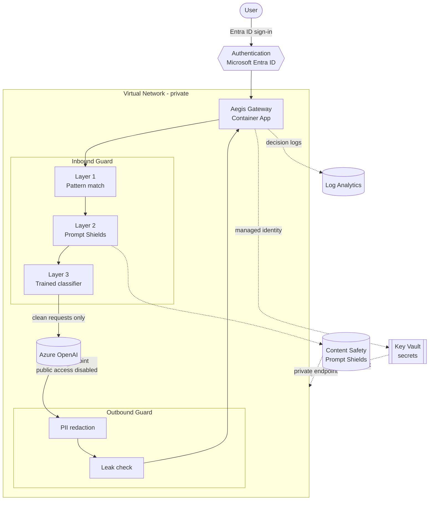
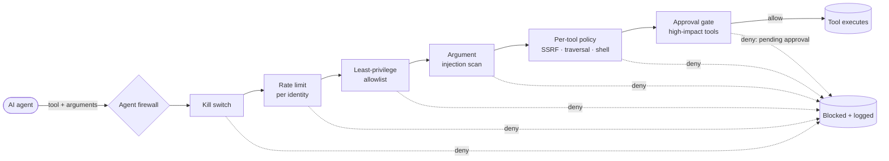

# Architecture & Threat Model — Aegis AI Gateway

This document describes the gateway's architecture, the security controls in
place, and the target hardened design. It distinguishes **what is deployed
today** from **what is designed as the next hardening step**, so the security
posture is honest and clear.

---

## What the gateway does

Aegis is a reverse proxy in front of Azure OpenAI. Every request passes through
an inbound guard before reaching the model, and every response passes through an
outbound guard before returning to the user. The goal is to stop prompt-injection
and jailbreak attacks and prevent sensitive-data leakage, while keeping the model
itself unreachable except through the gateway.

---

## Target hardened architecture

Request flow: a user authenticates with Microsoft Entra ID, the gateway runs the
three inbound layers, and only clean requests reach Azure OpenAI. The model's
reply passes back through the outbound guard (PII redaction and leak check)
before returning. Secrets are pulled from Key Vault using the app's managed
identity, and every allow/block decision is logged.

---

## Security controls

### Implemented and deployed

- **Layered inbound defense** — heuristic pattern match (Layer 1), Azure AI
  Content Safety Prompt Shields (Layer 2), and a self-trained TF-IDF + logistic
  regression classifier (Layer 3), run cheapest-first.
- **Outbound data-loss protection** — PII redaction (email, phone, SSN, card
  numbers) and an instruction-leak check on every model response.
- **Fail-closed safety** — if the Prompt Shields call fails, the request is
  blocked rather than allowed.
- **Keyless configuration** — no secret values in app config; keys live in Azure
  Key Vault and are retrieved at runtime via a system-assigned managed identity
  holding a least-privilege *Key Vault Secrets User* role.
- **Authentication** — Microsoft Entra ID sign-in required to reach the gateway.
- **Decision logging** — allow/block decisions written to Log Analytics.
- **Agentic tool-call firewall** — the `/agent` endpoint guards *actions*, not
  just words. Before an agent runs a tool it passes a least-privilege allowlist,
  a per-identity rate limit, an argument injection scan, per-tool argument policy
  (SSRF, path traversal, sensitive-file, destructive-shell), a human-in-the-loop
  approval gate for high-impact tools, and a global kill switch. See below.

### Designed as next hardening steps (not yet deployed)

- **Network isolation via private endpoints** — place the gateway in a
  VNet-integrated (workload-profiles) Container Apps environment, give Azure
  OpenAI, Content Safety, and Key Vault private endpoints, and disable their
  public network access so the model is reachable *only* through the gateway
  inside the VNet.
- **SIEM integration** — stream decision logs into Microsoft Sentinel with custom
  KQL analytics rules (for example, repeated blocks from one identity) and a
  monitoring workbook.

---

## Why the network isolation is designed, not deployed

Private endpoints on Azure Container Apps require the environment to be created
*with* a VNet — the network type can't be changed after creation — so enabling it
means recreating the environment as a workload-profiles environment with a
dedicated subnet, disabling public access on the backing services, and adding
private DNS zones. This carries additional cost and removes public reachability
used during development. The design and trade-offs are documented here as the
production hardening path; the current deployment keeps public ingress for
demonstration while relying on authentication and the guard layers.

---

## Agentic tool-call firewall

The chat guard protects a *conversation*. But an AI agent doesn't just talk — it
*acts*: it reads files, calls APIs, runs commands, sends email. Every action is a
place an attacker or a confused model can cause real damage. The `/agent`
endpoint is a firewall for those actions.

A caller sends the *intended* tool call — the tool name and its arguments — and
the firewall returns an allow/deny decision plus the control that decided it. The
agent runtime executes the tool only on an allow.

Checks run cheapest-and-most-severe first. Each maps to a risk in the **OWASP
Top 10 for Agentic Applications (2026)**:

| Control | What it stops | OWASP Agentic risk |
|---|---|---|
| **Kill switch** | Emergency stop for all agent action | Excessive agency |
| **Rate limit** (per identity) | Runaway loops draining quota / amplifying attacks | Excessive agency / resource abuse |
| **Least-privilege allowlist** | Agent invoking a tool it should never have | Excessive agency / tool misuse |
| **Argument injection scan** | Injected instructions smuggled inside tool arguments | Prompt injection reaching the action layer |
| **Per-tool argument policy** | SSRF to internal hosts / cloud metadata, path traversal, sensitive-file reads, destructive shell | Privilege escalation via unsafe arguments |
| **Approval gate** | Auto-execution of high-impact tools (`write_file`, `run_shell`, `send_email`) | Missing human-in-the-loop |

The SSRF check blocks loopback, private, link-local, and reserved IP ranges plus
the cloud metadata endpoint (`169.254.169.254`) and named metadata hosts — the
classic path an agent is tricked into handing out instance credentials. DNS
resolution of hostnames (DNS-rebinding defense) is the documented next step.

---

## STRIDE threat model

| Threat | Example | Mitigation | Status |
|---|---|---|---|
| **Spoofing** | Anonymous user hits the gateway | Microsoft Entra ID authentication required | Implemented |
| **Tampering** | Prompt injection overrides the model's instructions, or is smuggled into a tool argument | Three-layer inbound guard (patterns, Prompt Shields, trained classifier); argument injection scan on the `/agent` action layer | Implemented |
| **Repudiation** | No record of who did what | Allow/block decision logging to Log Analytics for both chat and tool-call decisions; Sentinel + identity correlation | Partial / planned |
| **Information disclosure** | Model leaks PII, is reached directly, or an agent is tricked into SSRF against cloud metadata | Outbound PII redaction and leak check; agent firewall blocks SSRF, path traversal, and sensitive-file reads (implemented); private endpoint with public access disabled (planned) | Partial |
| **Denial of service** | Flood of requests, or a runaway agent loop, exhausts the model quota | Container Apps autoscaling (planned); per-identity tool-call rate limiting on the `/agent` layer (implemented) | Partial |
| **Elevation of privilege** | Stolen API key used elsewhere, or an agent runs a tool / command it should not | No keys in app; managed identity + Key Vault least-privilege RBAC; least-privilege tool allowlist, destructive-shell block, and human-in-the-loop approval gate on the agent layer | Implemented |

---

## Summary

The gateway implements layered request/response defenses, keyless secret
handling via managed identity, and authenticated access today. The documented
next steps — private-endpoint network isolation and Sentinel-based detection —
complete a defense-in-depth posture suitable for a production service.
